  

<h1 align="center">Paul Cheng</h1>

  <b>Full-stack TypeScript developer building LLM applications and AI engineering workflows.</b>

  
  
  
  

---

## About

I build practical software across product engineering, LLM systems, and AI-assisted engineering workflows.

My current direction is turning AI demos into repeatable production practice: observable LLM calls, multi-model routing, prompt and tool workflows, and team-level adoption of AI coding tools.

## Control Surface

  

## Current Focus

- Building full-stack products with TypeScript, Next.js, React, Node.js, and SQL databases
- Developing LLM applications with streaming, RAG, function calling, and DONE signal parsing
- Integrating multiple model providers including Qwen, DashScope, GLM, DeepSeek, and OpenRouter
- Creating LLM observability infrastructure around logged calls, latency, tokens, and tool traces
- Exploring local image and video generation workflows with FLUX, ComfyUI, and Draw Things
- Helping a large embedded engineering team adopt AI coding tools in a practical, measurable way

## Stack

<table>
  <tr>
    <td><b>Languages</b></td>
    <td>TypeScript, JavaScript, Python, SQL</td>
  </tr>
  <tr>
    <td><b>Frontend</b></td>
    <td>Next.js 14, React, Tailwind CSS, Framer Motion, GSAP</td>
  </tr>
  <tr>
    <td><b>Backend and Data</b></td>
    <td>Node.js, Next.js API Routes, Prisma, PostgreSQL, MySQL, FastAPI, MinIO</td>
  </tr>
  <tr>
    <td><b>AI and LLM</b></td>
    <td>Streaming, RAG, function calling, tool use, multi-model routing, LLM call logging, prompt engineering</td>
  </tr>
  <tr>
    <td><b>DevOps</b></td>
    <td>Docker, docker-compose, AWS EC2, Git, GitHub, SSH deployment, pnpm</td>
  </tr>
</table>

## Engineering Style

- Product thinking before implementation detail
- Small, reviewable changes
- Explicit architecture decisions through ADRs
- Clean Core/API boundaries where they matter
- AI tools used as engineering leverage, not as shortcuts around understanding

## GitHub Signal

  
  

  

---

  <b>Building full-stack products, LLM systems, and AI-powered engineering workflows.</b>

