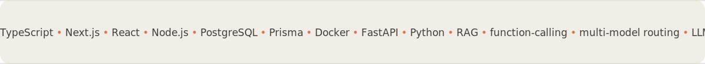

<!-- Profile README — Anthropic-inspired stacked section blocks.
     Each block is a self-contained animated SVG (CSS @keyframes inside the file),
     so the reveal / draw-on / marquee motion plays when GitHub loads it as an image. -->

  <a href="https://github.com/PaulCheng1122?tab=repositories"><b>Repositories</b></a>
  &nbsp;·&nbsp;
  Building full-stack products, LLM systems, and AI-powered engineering workflows.

