<!-- Profile README — one seamless animated SVG.
     All sections (hero, what I build, how I work, the stack, GitHub activity,
     tools marquee) are full-width bands inside a single rounded frame, so it
     reads as one continuous surface. Motion is baked in as CSS @keyframes and
     plays when GitHub loads the file as an image. Regenerated by
     scripts/gen_profile.py via .github/workflows/activity.yml. -->

  <a href="https://github.com/PaulCheng1122?tab=repositories"><b>Repositories</b></a>
  &nbsp;·&nbsp;
  Building full-stack products, LLM systems, and AI-powered engineering workflows.

