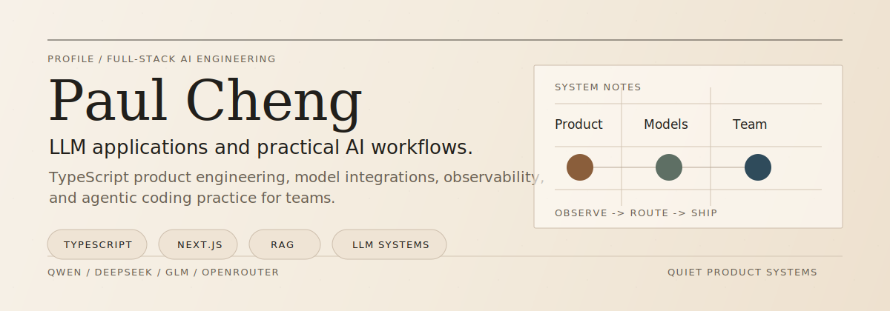
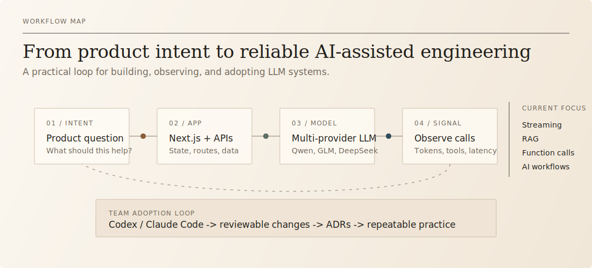

  

# Paul Cheng

I build full-stack TypeScript products and LLM systems, with a focus on making AI useful inside real engineering teams.

My work sits between product engineering, model integration, and team-level AI adoption: streaming interfaces, RAG, function calling, LLM observability, and agentic coding workflows.

---

## Work

  

## Current Questions

- How do we turn AI demos into production workflows that can be reviewed, observed, and improved?
- How should product code expose retrieval, tools, and model routing without becoming fragile?
- How can a large engineering team adopt AI coding tools without losing engineering judgment?

## Practice

| Area | Tools and habits |
| --- | --- |
| Product engineering | TypeScript, Next.js 14, React, Tailwind CSS, Framer Motion, GSAP |
| Backend and data | Node.js, Next.js API Routes, Prisma, PostgreSQL, MySQL, FastAPI, MinIO |
| LLM applications | Streaming, RAG, function calling, DONE parsing, multi-provider routing |
| Model providers | Qwen, DashScope, GLM, DeepSeek, OpenRouter |
| Engineering systems | Docker, AWS EC2, GitHub, SSH deployment, pnpm, ADRs, structured PRs |
| AI workflows | Claude Code, Codex, prompt engineering, local generation with FLUX and ComfyUI |

## Principles

- Start with the product question, then choose the technical shape.
- Keep changes small enough to review and systems explicit enough to debug.
- Treat AI as engineering leverage, not as a shortcut around understanding.
- Prefer workflows that teams can repeat, measure, and improve.

## Signal

  
  

---

  Full-stack products, LLM systems, and practical AI adoption.

